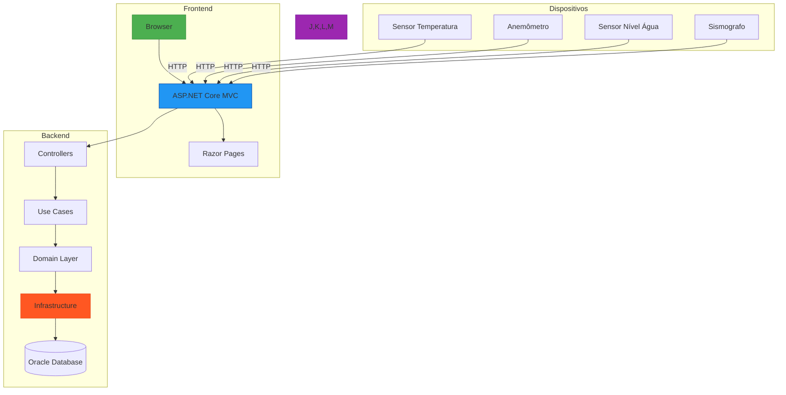

# AlertHaven - Sistema de Eventos e Alertas gerados por IoT

## Visão Geral Completa
Sistema integrado para gestão de:
- Dispositivos IoT (sensores ambientais)
- Eventos registrados
- Alertas gerados
- Interface administrativa web

## Rotas da API Detalhadas

### IoT Controller
| Método | Endpoint               | Parâmetros               | Status Codes          | Descrição |
|--------|------------------------|--------------------------|-----------------------|-----------|
| `GET`  | `/api/iot`             | -                        | 200 OK               | Lista todos dispositivos (simplificado) |
| `GET`  | `/api/iot/{id}`        | `id` (path)              | 200 OK, 404 Not Found | Detalhes completos do dispositivo |
| `POST` | `/api/iot`             | JSON (Body)              | 201 Created, 400 Bad Request | Cadastra novo dispositivo |
| `PUT`  | `/api/iot/{id}`        | `id` + JSON (Body)       | 200 OK, 404 Not Found | Atualização completa |
| `DELETE` | `/api/iot/{id}`      | `id` (path)              | 204 No Content, 404 Not Found | Remove dispositivo |

### Evento Controller
| Método | Endpoint               | Parâmetros               | Status Codes          | Descrição |
|--------|------------------------|--------------------------|-----------------------|-----------|
| `GET`  | `/api/evento`          | -                        | 200 OK               | Lista todos eventos (simplificado) |
| `GET`  | `/api/evento/{id}`     | `id` (path)              | 200 OK, 404 Not Found | Detalhes completos do evento |
| `GET`  | `/api/evento/iot/{IdIot}` | `IdIot` (path)        | 200 OK, 404 Not Found | Eventos por dispositivo IoT |
| `POST` | `/api/evento`          | JSON (Body)              | 201 Created, 400 Bad Request | Registra novo evento |
| `PATCH` | `/api/evento/{id}`    | `id` + JSON (Body)       | 200 OK, 404 Not Found | Atualização parcial |
| `DELETE` | `/api/evento/{id}`   | `id` (path)              | 204 No Content, 404 Not Found | Remove evento |

### Alerta Controller
| Método | Endpoint               | Parâmetros               | Status Codes          | Descrição |
|--------|------------------------|--------------------------|-----------------------|-----------|
| `GET`  | `/api/alerta`          | -                        | 200 OK               | Lista todos alertas |
| `GET`  | `/api/alerta/{id}`     | `id` (path)              | 200 OK, 404 Not Found | Detalhes do alerta |
| `GET`  | `/api/alerta/evento/{IdEvento}` | `IdEvento` (path) | 200 OK, 404 Not Found | Alertas por evento |
| `POST` | `/api/alerta`          | JSON (Body)              | 201 Created, 400 Bad Request | Cria novo alerta |
| `PATCH` | `/api/alerta/{id}`    | `id` + JSON (Body)       | 200 OK, 404 Not Found | Atualiza alerta |
| `DELETE` | `/api/alerta/{id}`   | `id` (path)              | 204 No Content, 404 Not Found | Remove alerta |

## Resumo das Funcionalidades por View

### Home
| View  | Funcionalidades Principais |
|-------|---------------------------|
| Index | Acesso rápido aos módulos<br>- Visão geral do sistema |

### IoT
| View   | Funcionalidades Principais |
|--------|---------------------------|
| Index  | - Mostrar todos os IoTs cadastrados |
| Create | - Validação em tempo real<br>- Dropdowns dinâmicos |
| Details| - Visualização completa<br>- Dados técnicos |
| Edit   | - Edição contextual |
| Delete | - Confirmação segura |

###  Evento
| View   | Funcionalidades Principais |
|--------|---------------------------|
| Index  | - Mostrar todos os eventos cadastrados |
| Create | - Validação em tempo real<br>- Dropdowns dinâmicos |
| Details| - Visualização completa<br>- Dados técnicos |
| Edit   | - Edição contextual |
| Delete | - Confirmação segura |

### Alerta
| View   | Funcionalidades Principais |
|--------|---------------------------|
| Index  | - Mostrar todos os alertas cadastrados |
| Create | - Validação em tempo real<br>- Dropdowns dinâmicos |
| Details| - Visualização completa<br>- Dados técnicos |
| Edit   | - Edição contextual |
| Delete | - Confirmação segura |

## Configuração

```bash
# Clonar repositório
git clone https://github.com/vitorvhsilva/AlertHaven-dotNet
cd AlertHaven

# Configurar conexão com o banco
cp appsettings.Development.json.example appsettings.Development.json
# Editar arquivo com suas credenciais

# Instalar dependências
dotnet restore

# Aplicar migrações
dotnet ef database update
```

## Diagrama



## Testes

**Link para Entrar no Workspace do Postman**: https://red-crater-624562.postman.co/workspace/My-Workspace~222938ca-e332-49fa-8596-15af3bbb1000/collection/34543089-443891c8-d15e-4b96-af45-0c413fd50473?action=share&creator=34543089

### IoT Controller
**Endpoint**  
`POST` → `https://localhost:7217/api/iot`

**Request Body**
```json
{
    "TipoIot": "ANEMÔMETRO",
    "UnidadeMedidaIot": "KM"
}
```

**Response Body**
```json
{
    "idIot": "b2aa2ef3-8f93-4420-84be-5e5387e53adc",
    "tipoIot": "ANENOMETRO",
    "latitudeIot": "",
    "longitudeIot": "",
    "ultimaLeituraIot": 0,
    "dataHoraUltimaLeituraIot": "0001-01-01T00:00:00",
    "unidadeMedidaIot": "KM"
}
```
---

**Endpoint**  
`GET` → `https://localhost:7217/api/iot`

**Response Body**
```json
{
[
    {
        "idIot": "85383d82-7911-41c2-8629-6e0b2b72930b",
        "tipoIot": "SISMOGRAFO",
        "latitudeIot": "latitudeTeste",
        "longitudeIot": "longitudeTeste",
        "ultimaLeituraIot": 20,
        "unidadeMedidaIot": "CELSIUS"
    }
]
}
```
---
**Endpoint**  
`GET` → `https://localhost:7217/api/iot/{IdIot}`

**Response Body**
```json
{
    "idIot": "0014a2e9-1fa3-4627-9a83-9cb57b6248f4",
    "tipoIot": "SENSOR_NIVEL_DE_AGUA",
    "latitudeIot": "latitudeTeste",
    "longitudeIot": "longitudeTeste",
    "ultimaLeituraIot": 20,
    "dataHoraUltimaLeituraIot": "2025-06-02T00:15:03.245397",
    "unidadeMedidaIot": "KM",
    "statusIot": "ATIVO",
    "eventos": [
        {
            "idEvento": "040f2528-7f20-4593-8512-ae711f0469a1",
            "idIot": "0014a2e9-1fa3-4627-9a83-9cb57b6248f4",
            "tipoEvento": "TORNADO",
            "intensidadeEvento": "ALTO",
            "latitudeEvento": "lagitudeTeste",
            "longitudeEvento": "longitudeTeste",
            "dataHoraEvento": "2025-05-28T14:30:00"
        },
        {
            "idEvento": "9ff939c3-0220-4e0c-99a9-101d83eb3b71",
            "idIot": "0014a2e9-1fa3-4627-9a83-9cb57b6248f4",
            "tipoEvento": "TORNADO",
            "intensidadeEvento": "ALTO",
            "latitudeEvento": "lagitudeTeste",
            "longitudeEvento": "longitudeTeste",
            "dataHoraEvento": "2025-05-28T14:30:00"
        }
    ]
}
```

---
**Endpoint**  
`PUT` → `https://localhost:7217/api/iot/{IdIot}`

**Request Body**
```json
{
    "tipoIot": "SENSOR_NIVEL_DE_AGUA",
    "latitudeIot": "latitudeTeste",
    "longitudeIot": "longitudeTeste",
    "ultimaLeituraIot": 20,
    "unidadeMedidaIot": "KM",
    "statusIot": "ATIVO"
}
```

**Response Body**
```json
{
    "idIot": "b2aa2ef3-8f93-4420-84be-5e5387e53adc",
    "tipoIot": "SENSOR_NIVEL_DE_AGUA",
    "latitudeIot": "latitudeTeste",
    "longitudeIot": "longitudeTeste",
    "ultimaLeituraIot": 20,
    "dataHoraUltimaLeituraIot": "2025-06-02T00:25:49.8857703-03:00",
    "unidadeMedidaIot": "KM",
    "statusIot": "ATIVO",
    "eventos": []
}
```

---
**Endpoint**  
`DELETE` → `https://localhost:7217/api/iot/{IdIot}`

---

### Evento Controller


## Dependências
| Componente       | Tecnologia/Pacote           | 
|------------------|-----------------------------|
| ORM              | Entity Framework Core       | 
| Banco de Dados   | Oracle Database             | 
| Mapeamento       | AutoMapper                  | 
| Documentação     | Swashbuckle.AspNetCore      | 
| Interface        | Razor Pages                 | 

